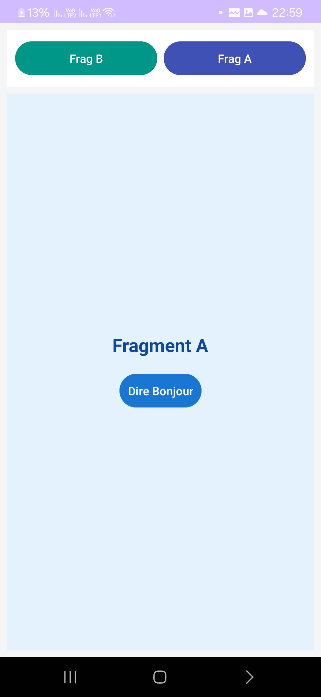
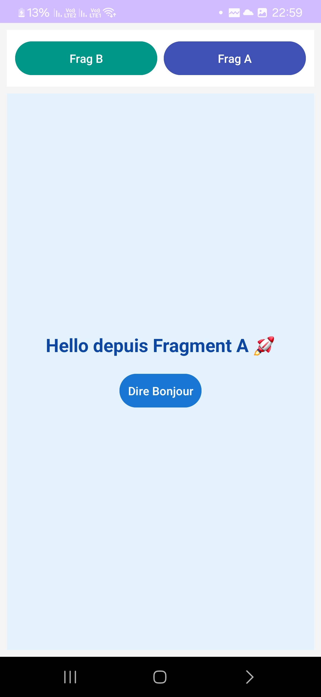
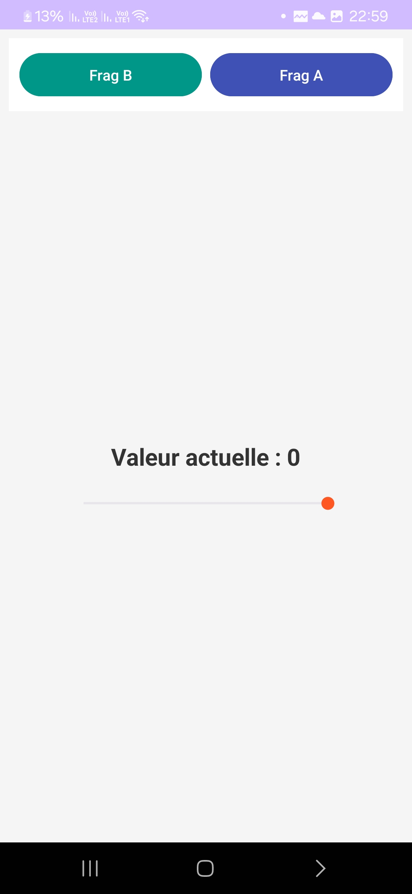
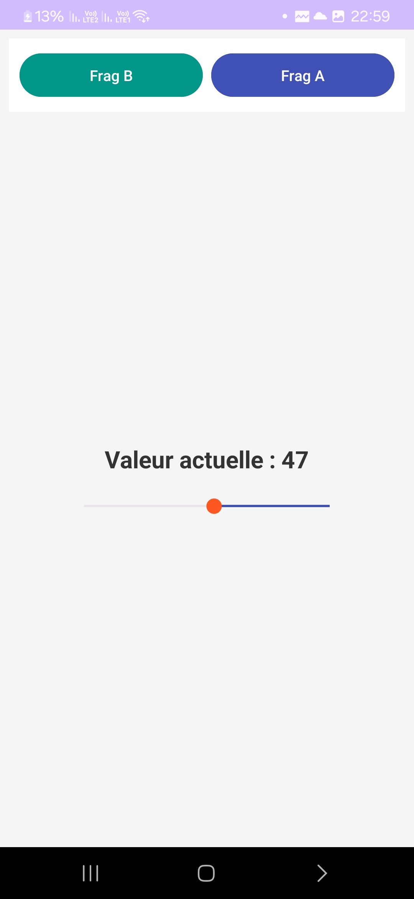

# 📱 Mini Projet Android – Gestion des Fragments

## 🎯 Objectif

Créer une application Android simple qui permet de :

* Naviguer entre deux fragments
* Interagir avec chaque fragment via un bouton
* Comprendre le fonctionnement des `Fragment` et des `FragmentTransaction`

---

## 🧱 Structure du projet

### 📂 Activités

* `MainActivity.java` : gère le changement de fragments

### 📂 Fragments

* `FragmentOne.java` : affiche un message avec un bouton
* `FragmentTwo.java` : affiche un autre message avec un bouton

### 📂 Layouts

* `activity_main.xml` : contient les boutons + container de fragments
* `fragment_one.xml`
* `fragment_two.xml`

---

## ⚙️ Fonctionnement

* Au démarrage → **FragmentOne** est affiché
* Bouton "Frag A" → affiche **FragmentOne**
* Bouton "Frag B" → affiche **FragmentTwo**
* Chaque fragment contient un bouton qui change le texte affiché

---

## 🧠 Concepts utilisés

* `Fragment`
* `FragmentManager`
* `FragmentTransaction`
* `FrameLayout` (container dynamique)
* `onViewCreated()`

---

## 🖼️ Screenshots

### 🔹 Écran principal

---

### 🔹 Fragment A

---

### 🔹 Fragment B

---

## 🚀 Résultat

✔ Navigation entre fragments
✔ Interface simple et fonctionnelle
✔ Interaction utilisateur avec boutons

---

## 👨‍💻 Auteur

* Nom : Madili Kenza
* Projet : Lab Fragments Android

---
